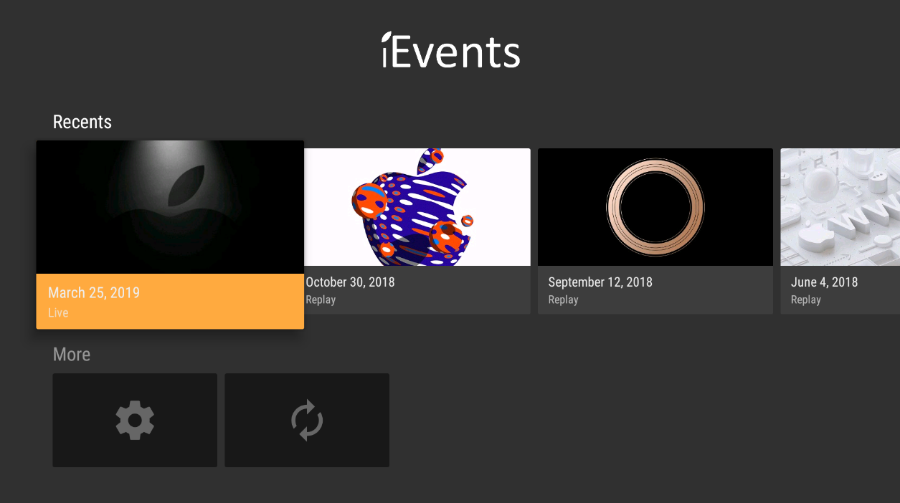
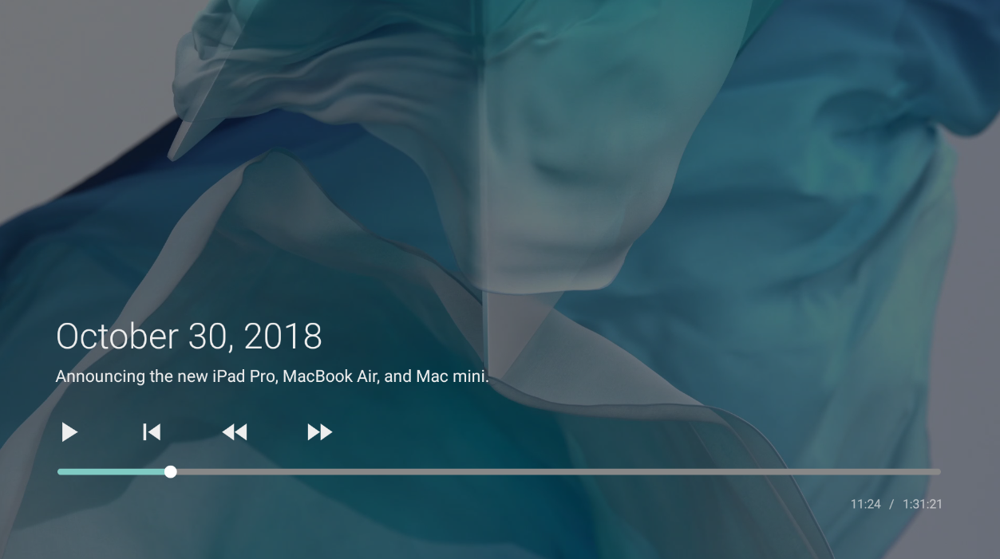
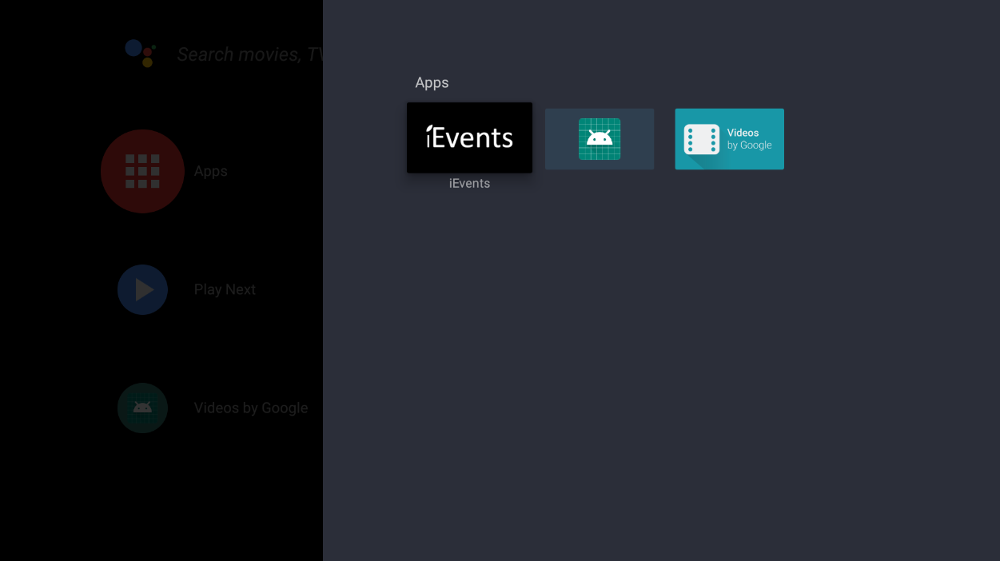

# Unofficial Apple Events app for Android TV

iEvents makes it easy to watch Apple's latest and upcoming keynotes on-demand and live directly from your Android TV setup.

## Download

- **[Version 1.0](https://time2code.net/iEvents_1_0.apk)**

## Requirements

- Android TV 6.0 or later

## Installation

Download the binary and sideload it onto your Android TV setup using apps such as [ES Explorer](https://play.google.com/store/apps/details?id=com.estrongs.android.pop).

## Screenshots

### Contributing

Feel free to contribute if you want to enhance the experience.

### External libraries

- [OkHttp](https://square.github.io/okhttp/) - HTTP & HTTP/2 client
- [Glide](https://github.com/bumptech/glide) - Image loading framework
